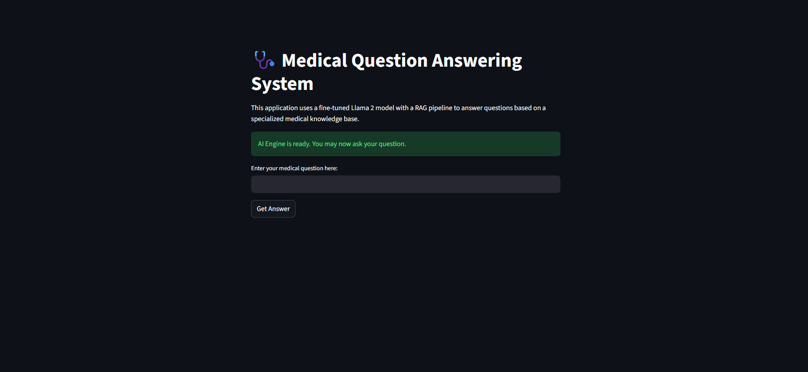
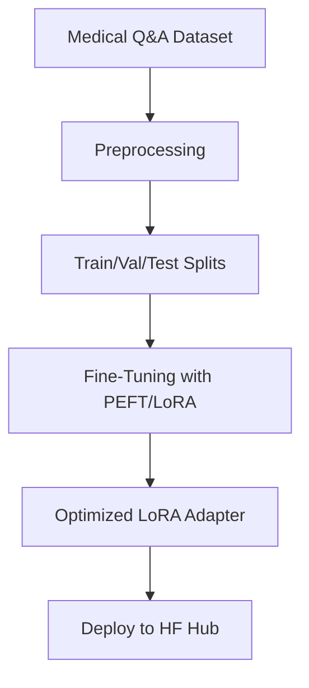
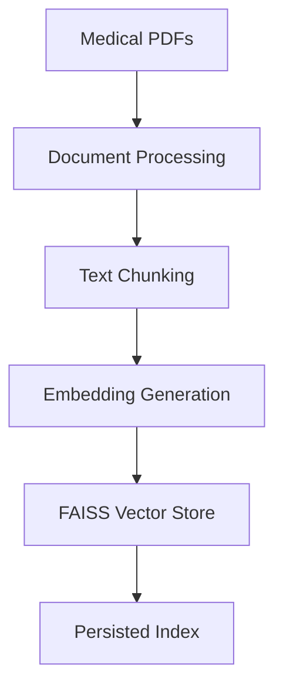
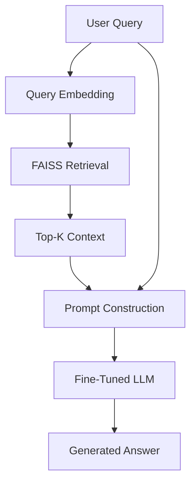

#  Medical Question-Answering with RAG and Fine-Tuned Llama 2

[](https://ai.meta.com/resources/models-and-libraries/llama-downloads/)
[](https://huggingface.co/spaces/Sumanth4/medical-qa-rag)
[](https://www.python.org/)



---

##  Project Overview

An end-to-end Medical RAG system. This application uses a custom-trained Llama 2 model to understand medical queries and retrieves factual context from a FAISS vector database to generate accurate, evidence-based answers.

### Core Capabilities

- **Domain-Specialized Intelligence**: Fine-tuned Llama 2 7B model trained specifically on medical Q&A datasets
- **Knowledge-Augmented Responses**: RAG (Retrieval-Augmented Generation) integration for factually grounded answers
- **Instant Access**: Query a comprehensive knowledge base of medical research papers in real-time
- **Production-Ready**: Deployed on Hugging Face Spaces with Streamlit interface

>  **Key Insight:** This system functions like an expert physician with both specialized training and instant access to a complete medical library, ensuring responses are both knowledgeable and evidence-based.

---

##  Live Demo

Experience the system in action with our deployed demo using TinyLlama for accessibility:

**[ Try the Live Demo](https://huggingface.co/spaces/Sumanth4/medical-qa-rag)**

---

##  System Architecture

The system is built on **three interconnected pipelines**:

###  Fine-Tuning Pipeline
Transforms the base LLM into a medical domain expert through specialized training.



**Purpose**: Teaches the model medical terminology, reasoning patterns, and response styles

###  RAG Indexing Pipeline
Creates a searchable vector database from medical literature.



**Purpose**: Builds the knowledge base for contextual retrieval during inference

###  Inference Pipeline
Combines fine-tuned intelligence with retrieved context for optimal answers.



**Purpose**: Real-time question answering with both learned expertise and retrieved evidence

---

## Project Structure

```
medical-qa-rag/
│
├── README.md                          # Project documentation
├── requirements.txt                   # Python dependencies
├── .gitignore                        # Git exclusions
├── config.py                         # Configuration settings
├── app.py                            # Streamlit application
│
├── data/
│   └── raw/                          # Source datasets
│
├── artifacts/                        # Generated resources (gitignored)
│   ├── fine_tuned_model/            # LoRA adapters
│   └── vector_store/                # FAISS index + chunks
│
├── notebooks/
│   └── model_finetuning.ipynb     # Training notebook
│
└── src/
    ├── core/                         # Core functionality
    │   ├── document_processor.py    # PDF processing
    │   ├── embedding_engine.py      # Vector embeddings
    │   ├── vector_database.py       # FAISS operations
    │   ├── llm_handler.py          # Model inference
    │   └── rag_system.py           # RAG orchestration
    │
    ├── pipeline/                     # Execution pipelines
    │   ├── training_pipeline.py    # Indexing workflow
    │   └── inference_pipeline.py   # Query workflow
    │
    └── utils/
        └── logger.py                # Logging utilities
```

---

##  Technology Stack

### AI/ML Framework
- **Deep Learning**: PyTorch, Transformers (Hugging Face)
- **Efficient Training**: PEFT (Parameter-Efficient Fine-Tuning), LoRA
- **Data Processing**: datasets, scikit-learn

### Models
- **LLM**: `meta-llama/Llama-2-7b-hf` (fine-tuned)
- **Embeddings**: `all-MiniLM-L6-v2` (sentence-transformers)

### RAG & Retrieval
- **Vector Store**: FAISS (Facebook AI Similarity Search)
- **Framework**: LangChain
- **Document Processing**: PyMuPDF, Pandas, NumPy

### Deployment
- **Interface**: Streamlit
- **Hosting**: Hugging Face Spaces
- **Model Hub**: Hugging Face Hub
- **Containerization**: Docker

### MLOps
- **Version Control**: Git, Git LFS
- **Environment**: python-dotenv
- **Dependencies**: pip, requirements.txt

---

##  Getting Started

### Prerequisites
- Python 3.11+
- 8GB+ RAM (16GB recommended)
- GPU recommended for fine-tuning

### Installation

1. **Clone the repository**
```bash
git clone https://github.com/Sumanthcs4/medical-qa-rag.git
cd medical-qa-rag
```

2. **Set up virtual environment**
```bash
python -m venv venv
source venv/bin/activate  # Windows: venv\Scripts\activate
```

3. **Install dependencies**
```bash
pip install -r requirements.txt
```

### Building the Knowledge Base

Run the training pipeline to process medical PDFs and create the FAISS index:

```bash
python -m src.pipeline.training_pipeline
```

This will:
- Process all PDFs in `data/raw/`
- Generate embeddings using `all-MiniLM-L6-v2`
- Create and persist the FAISS vector database
- Save artifacts to `artifacts/vector_store/`

### Running the Application

Launch the Streamlit interface (configured with TinyLlama for local deployment):

```bash
streamlit run app.py
```

Access the application at `http://localhost:8501`

---

##  Model Performance

Evaluation metrics on the `medical_meadow_medqa` test split:

| Metric | Base Llama 2 7B | Fine-Tuned Llama 2 7B | Improvement |
|--------|-----------------|----------------------|-------------|
| **BERTScore (F1)** | Baseline | **0.798** | ✅ Significant |
| **ROUGE-L** | Baseline | 0.050 | - |
| **BLEU** | Baseline | 0.0107 | - |

### Key Insights

- **BERTScore (0.798)**: Demonstrates strong semantic understanding and contextual relevance, even when wording differs from reference answers
- **ROUGE-L/BLEU**: Lower scores reflect the model's ability to paraphrase and explain concepts naturally rather than memorizing exact phrasings
- Fine-tuning successfully adapted the model to medical domain reasoning and terminology

---

##  Roadmap & Future Enhancements

### Evaluation & Metrics
- [ ] Implement RAG retrieval evaluation (Hit Rate, MRR)
- [ ] Add human evaluation framework for answer quality
- [ ] Benchmark against other medical QA systems

### Engineering & Reliability
- [ ] Custom exception handling system
- [ ] Comprehensive test suite with pytest
- [ ] CI/CD pipeline for automated testing
- [ ] Monitoring and logging infrastructure

### Features
- [ ] Multi-modal support (medical images, charts)
- [ ] Conversation history and follow-up questions
- [ ] Source citation and confidence scoring
- [ ] Medical specialty-specific fine-tuning

### Deployment
- [ ] API endpoint for programmatic access
- [ ] Load balancing for production traffic
- [ ] Model quantization for edge deployment

---

##  License

This project uses the Llama 2 model, which is subject to Meta's Llama 2 Community License Agreement. See the [official license](https://ai.meta.com/resources/models-and-libraries/llama-downloads/) for details.

---

##  Contributing

Contributions are welcome! Please feel free to submit issues, fork the repository, and create pull requests.

---

##  Contact

**Project Maintainer**: Sumanth  
**Hugging Face**: [@Sumanth4](https://huggingface.co/Sumanth4)
**Email**: [@Sumanth C S](mailto:ssumanth510@gmail.com)

---

##  Acknowledgments

- Meta AI for the Llama 2 model
- Hugging Face for infrastructure and model hosting
- The medical research community for open-access literature

---

** If you find this project useful, please consider giving it a star!**
